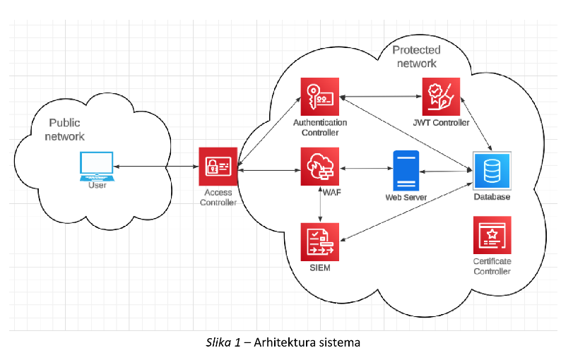

# ForumSecurity — Full‑stack Forum with JWT (Spring Boot + Angular)

This project is a complete **forum** application with a Spring Boot backend and an Angular frontend. 
It supports **JWT authentication**, **role/permission flags**, **topic (forum) and comment CRUD**, basic **email verification codes**, and file‑based request logging. 
The backend persists data in **MySQL**, issues tokens with **JJWT**, and hashes passwords with **BCrypt**. The frontend is an **Angular 18** app that consumes the REST API and stores the JWT in session storage.

> This repository contains two projects:
> - `spring-api` – Spring Boot (Java 17+) REST API  
> - `angular-ui` – Angular 18 client (ng serve on :4200)

<div align="center">
  
</div>


---

## Features

- **Authentication & Authorization**
  - Login with **username + password** (passwords are stored with **BCrypt**).
  - **JWT** issuance and validation (Bearer tokens in the `Authorization` header).
  - Role/permission flags on `User` model (`role`, `permission`) for future authorization rules.

- **Forum & Comments**
  - Create and list **forums/topics**.
  - Add, edit, delete **comments** per forum.
  - `Comment.allowed` flag present for simple moderation (used in UI).

- **Admin operations**
  - List users, create user (password stored as BCrypt), delete user, find by username.

- **Email verification (demo)**
  - Send one‑time **verification code** to an email.
  - Verify code endpoint toggles a session “verified” state on the client.
  - Codes are stored **in memory** (non‑persistent; restart clears them).

- **Logging**
  - Simple append‑only file logging to `Logs.txt` (backend).

---

## High‑level Architecture

```
Project/
├─ spring-api/                 # Spring Boot backend (Java 17+ / Spring Boot 3.3.x)
│  ├─ src/main/java/com/spring-api/
│  │  ├─ forum/controllers/       # AccessController (+ Admin, JWT scaffolding)
│  │  ├─ forum/models/            # User, Forum, Comment, MailStructure
│  │  ├─ forum/repositories/      # JPA repositories (User/Forum/Comment)
│  │  ├─ forum/security/          # WebSecurityConfig, JWTFilter
│  │  └─ forum/services/          # AuthService, UserService, ForumService, CommentService,
│  │                               # JWTService, MailService, LoggingService
│  ├─ src/main/resources/
│  │  └─ application.properties   # MySQL & SMTP config (replace secrets!)
│  └─ pom.xml
└─ angular-ui/              # Angular 18 front‑end
   ├─ src/app/components/         # login, register, forum, topic, admin-panel, verification, navbar
   ├─ src/app/services/           # auth.service.ts, forum.service.ts, admin.service.ts
   └─ package.json
```

**Backend stack:** Spring Boot 3.3.x, Spring Web, Spring Security, Spring Data JPA, MySQL, Java Mail, JJWT.  
**Frontend stack:** Angular 18, HttpClient, Tailwind CSS (configured), SSR scaffolding present but not required for dev.

---

## Backend (Spring Boot)

### Configuration
Edit `Project/spring-api/src/main/resources/application.properties` (or, better, use environment variables). Current file contains demo values:

```
spring.datasource.url=jdbc:mysql://localhost:3306/spring-api
spring.datasource.username=root
spring.datasource.password=password123
spring.jpa.show-sql=true
spring.jpa.hibernate.ddl-auto=update
spring.jpa.properties.hibernate.dialect=org.hibernate.dialect.MySQL8Dialect

# SMTP (used by MailService; replace with your credentials or app password)
spring.mail.host=smtp.gmail.com
spring.mail.port=587
spring.mail.username=you@example.com
spring.mail.password=YOUR_APP_PASSWORD
spring.mail.properties.mail.smtp.auth=true
spring.mail.properties.mail.smtp.starttls.enable=true
```

> ⚠️ **Security note**: do **not** commit real DB or SMTP credentials. Move them to environment variables or a secrets manager and reference them in `application.properties` using `${ENV_VAR_NAME}` placeholders.

### Build & Run
From `Project/spring-api/`:

```bash
# Using Maven Wrapper (recommended)
./mvnw spring-boot:run           # macOS/Linux
mvnw.cmd spring-boot:run         # Windows

# Or a standard build
./mvnw clean package
java -jar target/spring-api-0.0.1-SNAPSHOT.jar
```

The API will start on **http://localhost:8080**.

### Security & CORS
`WebSecurityConfig` enables CORS for the frontend dev server and installs a `JWTFilter`.  
Allowed origin in code is `http://localhost:4200` by default (Angular dev server).  
Bearer tokens are expected in the `Authorization` header.

### Data model (JPA)
- **User**: `id`, `username`, `password(BCrypt)`, `role`, `permission`, `email`
- **Forum**: `id`, `title`, `description`, `comments: List<Comment>`
- **Comment**: `id`, `content`, `author`, `createdTime`, `allowed`, `forum: Forum`

### REST API (selected endpoints)
_All paths are prefixed with_ **`/api/forums`** _(class‑level mapping in `AccessController`)._

**Auth & token**
- `POST /api/forums/login` → returns `{ token, user }` if credentials are valid
- `GET  /api/forums/validateToken` → checks `Authorization: Bearer <jwt>` and returns 200/401

**Admin**
- `GET  /api/forums/admin/users` → list users
- `POST /api/forums/admin/users` → create user (password encodes with BCrypt)
- `GET  /api/forums/admin/users/{username}` → fetch by username
- `DELETE /api/forums/admin/users/{userId}` → delete user

**Forums**
- `GET  /api/forums` → list forums
- `GET  /api/forums/{id}` → get forum by id
- `POST /api/forums` → create forum (`{ "title": "...", "description": "..." }`)

**Comments**
- `GET  /api/forums/{forumId}/comments` → list comments for a forum
- `POST /api/forums/{forumId}/comments` → add comment
- `PUT  /api/forums/{forumId}/comments/{commentId}` → update comment
- `DELETE /api/forums/comments/{commentId}` → delete comment

**Mail / verification**
- `POST /api/forums/sendmail/{mail}` → sends a verification code to `mail`
- `POST /api/forums/verify-code/{username}/{code}` → verifies the code stored for `username`

> **Auth header**: For protected endpoints, include  
> `Authorization: Bearer <token>`

#### Example: login, create a forum, and add a comment

```bash
# Login
curl -s -X POST http://localhost:8080/api/forums/login   -H "Content-Type: application/json"   -d '{"username":"admin","password":"secret"}'

# Use the token from the response (replace VALUE below)
TOKEN=VALUE

# Create a forum
curl -s -X POST http://localhost:8080/api/forums   -H "Authorization: Bearer $TOKEN" -H "Content-Type: application/json"   -d '{"title":"Welcome","description":"Introduce yourself"}'

# Add a comment
curl -s -X POST http://localhost:8080/api/forums/1/comments   -H "Authorization: Bearer $TOKEN" -H "Content-Type: application/json"   -d '{"content":"Hello everyone!","author":"alex"}'
```

---

## Frontend (Angular 18)

### Prerequisites
- Node.js 18+
- Angular CLI (optional): `npm install -g @angular/cli`

### Install & Run
From `angular-ui/`:

```bash
npm install
npm start           # = ng serve
# App runs at http://localhost:4200
```

The frontend uses the base API URL `http://localhost:8080/api/forums` (see `src/app/services/*.ts`).  
JWT is stored in `sessionStorage["token"]` and sent via `Authorization: Bearer <token>` in service calls.

### Screens (components)
- `login` – sign in and obtain a token.
- `register` – create a user (via admin endpoint in this codebase).
- `forum` – list of topics (forums).
- `topic` – view a single topic, add/edit/delete comments.
- `admin-panel` – simple user admin (list, create, delete).
- `verification` – enter email code; uses `/sendmail` and `/verify-code` endpoints.
- `navbar` – top navigation and auth state indicator.

---

## Logging & Files

- Backend appends text logs to **`spring-api/Logs.txt`** via `LoggingService.log(...)`.
- Email verification codes are kept **in memory** (`MailService`); they are not persisted to the DB.
- JPA `ddl-auto=update` will create/update tables in your MySQL database named `spring-api` on first run.

---

## Production notes & hardening

- Move DB/SMTP secrets out of `application.properties`; use env vars or a secrets manager.
- Configure a **stable JWT signing key** (persisted), not a per‑boot random key.
- Consider adding method‑level authorization (e.g., `@PreAuthorize`) on admin endpoints.
- Add refresh tokens / token expiry handling (there is a `validateToken` endpoint; consider a `refresh` flow).
- Replace file logging with a proper logger (Logback) and rotate logs.
- Add input validation and request DTOs for Forum/Comment creation.

---

## Quick Troubleshooting

- **CORS errors in the browser**: make sure backend is on `:8080`, frontend on `:4200`, and `WebSecurityConfig` allows `http://localhost:4200`.
- **401 Unauthorized**: include `Authorization: Bearer <token>`; verify token is not expired and signed with the same key.
- **DB connection failures**: confirm MySQL is running and credentials/URL are correct.
- **Mail not sending**: use an app password and enable SMTP in your email account or switch to a transactional provider.

---

## License

This project is licensed under the MIT License - see the LICENSE file for details.
